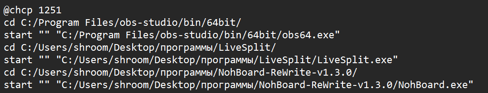

# Shortcut Creator
This is a tkinter app that creates shortcuts which open multiple apps at once.

# How to use
Download the .exe file from the releases tab, and open it.

The first button has you choosing the files you want to be opened by your shortcut.
The second button has you choosing the name and location for the shortcut, and then creates the shortcut.
The third button can clear the selected files if you accidentaly made a mistake.

# What it actually does
The program creates a batch (.bat) file that goes into programs' directories and opens the programs themselves in order.
An example script looks like this:

* @chcp 1251 - this is for cyrillic characters support

* cd "path" - this is for going into the programs' directories

* start "" "path" - this is for starting the programs themselves

# Changelog
* Version 1.0.0
    * Working logic and gui

# Made by
shroom